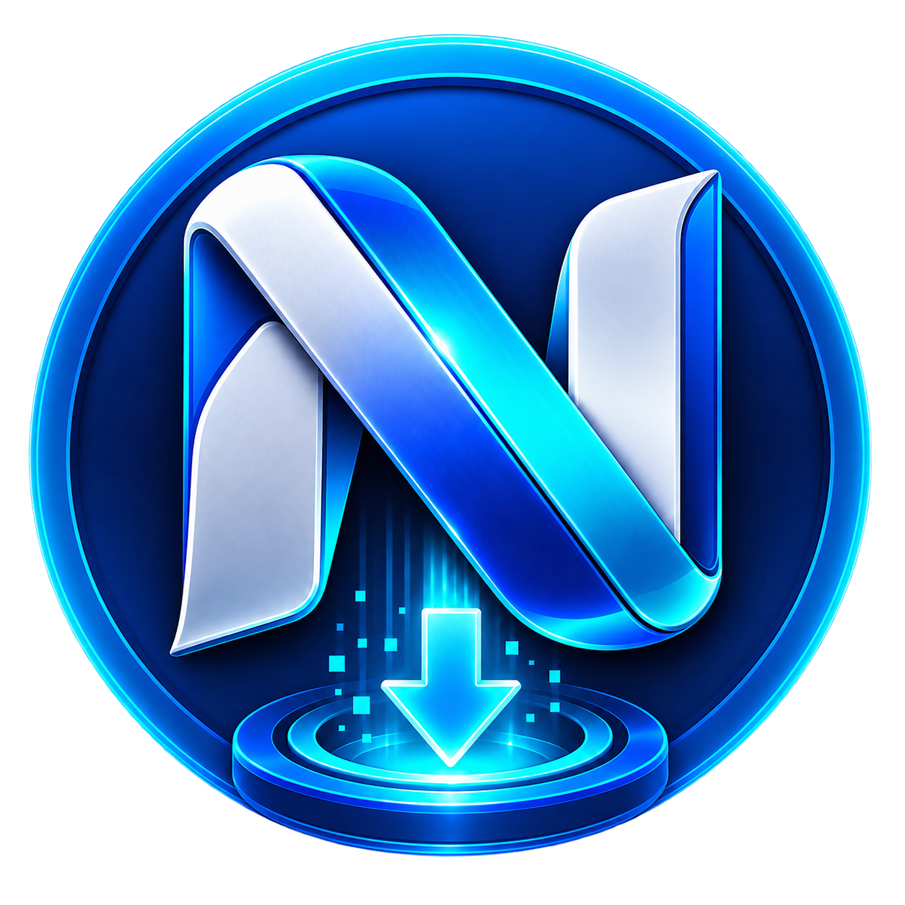

# NewzDeck

  

  <strong>A modern Usenet newsreader, downloader, and personal media automation app for Windows.</strong>

  <a href="https://www.newzdeck.com/">Website</a> ·
  <a href="https://github.com/newzdeckadmin/NewzDeck/releases/latest">Download</a> ·
  <a href="https://github.com/newzdeckadmin/NewzDeck/issues">Report an issue</a>

## Download

The current stable release is **NewzDeck v3.6.7** for 64-bit Windows.

**Recommended:** download `NewzDeck_v3.6.7_Setup.exe` from the [latest release](https://github.com/newzdeckadmin/NewzDeck/releases/latest).

A Portable ZIP is also available if you prefer to run NewzDeck without a normal installation.

NewzDeck is free and open source. **Usenet access is not included** — you need your own Usenet provider account. Automation and interactive NZB search can also use your own Newznab-compatible indexer.

## What NewzDeck does

- **Browse newsgroups visually** with gallery and list views, image/video previews, grouping, tabs, bookmarks, filtering, and search.
- **Download at high speed** through the bundled private SABnzbd engine with queue controls, retries, provider-aware transfers, PAR2 verification/repair, unpacking, and post-processing.
- **See downloads live** with near-real-time transfer state, stable Active cards, and live Verify, Repair, Unpack, and Smart Import progress.
- **Discover movies and TV** with TMDB-powered posters, backdrops, metadata, cast/crew, trending titles, new releases, recommendations, filtering, and responsive title details.
- **Automate TV and movies** with monitored libraries, quality profiles, Wanted items, calendar, history, root folders, and Newznab-compatible indexers.
- **Organize completed media** with Smart Import, including identification, renaming, moving, duplicate/existing-media handling, and cleanup of completed download folders.
- **Grab and organize once** from Discover without having to add the Movie or safely identifiable TV release to Automation first.
- **Keep downloads running in the background** with the Windows background service and system tray companion.

## v3.6.7 highlights

v3.6.7 is a browsing-responsiveness release built on v3.6.6. It pairs the high-throughput adaptive preview engine with lower paging latency, less stale network work, smoother continuous scrolling, and bounded long-session UI pressure.

- **Stale preview cancellation:** obsolete image/video BODY work is interrupted when changing groups, pages, views, filters, or leaving Browse.
- **Warm header connections:** up to two short-lived header sessions remove repeated connect/authentication latency from interactive paging.
- **Predictive continuous paging:** the next older header page is fetched several viewport-heights before the bottom so it can often append immediately.
- **Velocity-aware thumbnails:** fast scrolling expands thumbnail look-ahead in the direction of travel; slow scrolling contracts it again.
- **Progressive package reconstruction:** large All Posts package pages can appear sooner while deep multipart reconstruction finishes in the background.
- **Long-scroll memory relief:** far-offscreen decoded thumbnails are released in bounded batches while cached URLs remain available for fast return scrolling.
- **v3.6.6 preserved:** adaptive preview scaling and download-priority behavior remain intact.
## Requirements

- Windows 10 or Windows 11, 64-bit
- A Usenet provider account with NNTP server credentials
- Internet access for provider connections and online metadata
- Optional: a Newznab-compatible indexer for Automation and interactive NZB search

## Getting started

1. Download and run the latest **Setup.exe**.
2. Start NewzDeck.
3. Open **Settings** and add your Usenet provider details.
4. Browse or search newsgroups and start downloading.
5. If you want TV/movie automation, add your media root folders and configure a compatible indexer.

Your NewzDeck settings, history, queue state, provider configuration, and other persistent data are stored separately from the program files under `%LOCALAPPDATA%\NewzDeck`, so normal application updates preserve your data.

## Windows SmartScreen

NewzDeck is currently distributed **unsigned**, so Windows may show an **Unknown Publisher** or Microsoft Defender SmartScreen warning.

Only download NewzDeck from this repository or the official website. The release includes `NewzDeck_v3.6.7_SHA256.txt` so you can verify the installer and Portable ZIP before running them.

## Updating

Installed users should normally install the newest Setup.exe over their existing installation or use NewzDeck's verified update flow when offered.

Portable users should close NewzDeck before replacing the application files. See [UPDATING.txt](UPDATING.txt) for the short update guide.

## Troubleshooting and support

If something is not working, check NewzDeck's in-app status and diagnostic information first. When reporting a problem, include the NewzDeck version, what you were doing, what you expected to happen, and any relevant error message or screenshot.

[Open a GitHub issue](https://github.com/newzdeckadmin/NewzDeck/issues)

Please do **not** post Usenet passwords, API keys, tokens, or other private credentials in an issue.

## Open source

NewzDeck-owned source code in this repository is licensed under the **GNU General Public License v3.0 only (GPL-3.0-only)** unless a file or third-party notice says otherwise. See [LICENSE](LICENSE).

Third-party software, services, data, logos, and other assets retain their own licenses and terms. See [THIRD_PARTY_NOTICES.md](THIRD_PARTY_NOTICES.md).

For source-publication history and release provenance, see [docs/SOURCE_RELEASES.md](docs/SOURCE_RELEASES.md).

## Building from source

Most people do not need to build NewzDeck themselves. The official Windows binaries are built from the public source in this repository. Contributor build notes are available under [`release/windows/`](release/windows/README.md).
